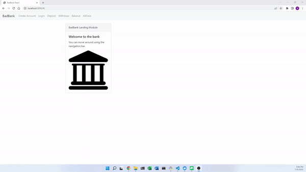

# Better-Bank

# Motivation

This is an improvement on "Bad Bank." That code is available <a href="https://github.com/WillRobinson152/BadBankExercise">here</a>, and the site hosted through AWS is available <a href="http://willrobinson-bankingapp.s3-website-us-east-1.amazonaws.com/#/">here</a>.

Both "Bad Bank" and "Better Bank" are assignments I completed during the MITx Full Stack Developer program. This repository includes an "original" directory that houses files that create a banking application from scratch using html, JavaScript and CSS (including Bootstrap templates), as well as a "react" directory that relies on the React framework. It utilizes Bootstrap on the front-end and connects to MongoDB through a Docker on the back-end.

# Usage

Download or clone the files in this repository to run locally on an http server.

# In action

